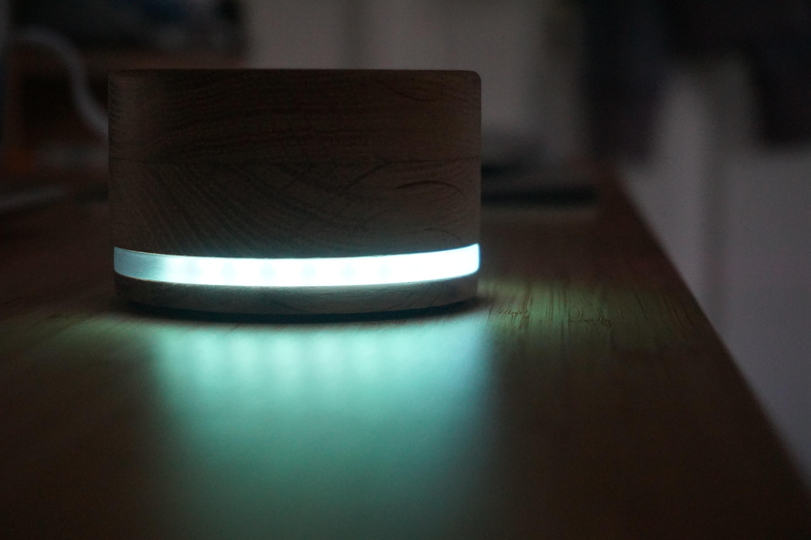

A USB volume knob powered by Raspberry Pi Pico, featuring a stylish minimalist look, tactile & intuitive controls, RGB audio visualisation, and integration with the Spotify desktop app.

## 🔊 Specs
### Hardware
- Raspberry Pi Pico Rev3
- KY-040 incremental rotary encoder (with detents removed)
- Adafruit 24 RGB Neopixel ring
- SN74AHCT125 logic level shifter
- Custom veroboard PCB
- Custom wooden exterior, laser-cut diffuser and 3D printed internals

### Software
- [ampy](https://pypi.org/project/adafruit-ampy/) (Adafruit MicroPython tool) 1.0.7
- VSCode tasks to automate build process

#### Device
- [MicroPython](https://micropython.org/) 1.18
- [Neopixel Pico library](https://github.com/blaz-r/pi_pico_neopixel)

#### Host
- [Python](https://python.org) 3.10.4
- [pyserial](https://pypi.org/project/pyserial/) 3.5
- [pycaw](https://pypi.org/project/pycaw/) 20220416
- [winsdk](https://pypi.org/project/winsdk/) 1.0.0b4
- [SoundCard](https://pypi.org/project/SoundCard/) 0.4.2

## 🎵 Links
- [Interactive Pico Pinout](https://pico.pinout.xyz/)
- [MicroPython docs](https://docs.micropython.org/en/latest/index.html)
- [ampy on GitHub](https://github.com/scientifichackers/ampy)

---

### TODO
- Catch errors and problems due to lack of spotify, windows being minimised, lost connection to audio device, etc.
- Add config file
- Improve encoder read robustness
- Output log to file
- Sort out volume compensation for audio visualisations
- Implement switchable audio visualisations
- Potentially add success/fail messages so we don't give the user feedback when it didn't work
- Package up and get running automatically as a background process
- System tray icon/menu
- Lock to specific app
- Optimisation: don't send spectrum/vu data if no music is playing